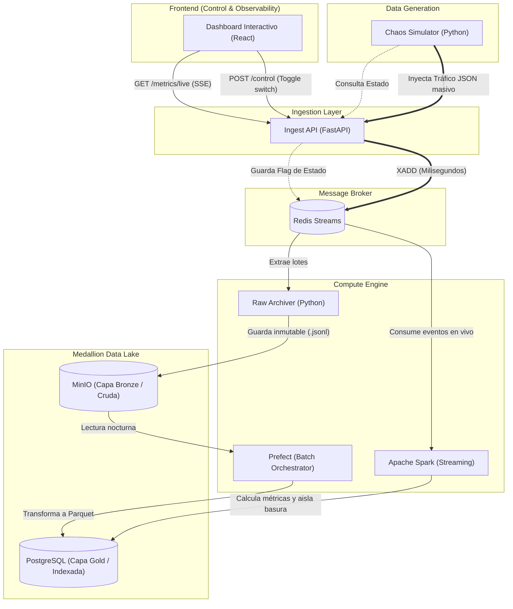

# high-concurrency-streaming-pipeline

# Plataforma de Telemetría, Streaming y Control de Caos en Tiempo Real

## El Objetivo
Diseñar, desplegar y orquestar una arquitectura de datos end-to-end capaz de procesar telemetría en tiempo real y alta concurrencia para un ecosistema de catálogos digitales y ticketing (TapDrink).

El sistema cuenta con un panel de control interactivo (UI) para monitorear la salud de la plataforma, visualizar métricas agregadas y controlar los picos de estrés del simulador de forma eficiente, implementando un enfoque pragmático de observabilidad y un paradigma ELT robusto.

## La Arquitectura (Qué vamos a hacer)
El proyecto se divide en 7 componentes interconectados, diseñados para correr en contenedores de forma aislada mediante Docker Compose:

1.  **Generador de Carga (Chaos Simulator):** Un script en Python que inyecta miles de eventos por segundo (JSONs) simulando navegación de usuarios, carritos abandonados, compras de tickets y eventos malformados para estresar el sistema.
2.  **Capa de Ingesta y API Gateway:** Una API (**FastAPI**) que actúa como el puente central de la plataforma. Recibe la telemetría del simulador, expone endpoints HTTP optimizados para el frontend y gestiona los comandos de control del sistema modificando flags en Redis.
3.  **Amortiguador de Ingesta (Buffer):** Uso de **Redis** (Streams/Pub-Sub) para absorber picos masivos de tráfico (simulando eventos de venta de entradas) y actuar como almacenamiento en caché de métricas calientes de corto plazo.
4.  **Data Lake y Almacenamiento Crudo (Landing / Bronze):** Despliegue de **MinIO** (almacenamiento de objetos compatible con AWS S3) para guardar los eventos JSON originales de forma inmutable, protegiendo los datos frente a fallos de procesamiento.
5.  **Procesamiento de Streaming (Hot Path):** Un clúster de **Apache Spark (PySpark)** estructurado para consumir la cola de Redis, agregar métricas en ventanas de 5 segundos, filtrar el fraude y actualizar los contadores en tiempo real dentro de Redis/PostgreSQL.
6.  **Almacenamiento Indexado:** **PostgreSQL** configurado con particionamiento lógico para recibir la data procesada en tiempo real y servir como persistencia analítica de negocio.
7.  **Dashboard Interactivo y Panel de Control (React / Vite):** Una aplicación frontend desarrollada en React que consume métricas agregadas desde la API mediante **Polling de alta frecuencia (Short Polling)** a intervalos de 2 segundos. Renderiza el estado del flujo utilizando **React Flow** y ofrece controles directos (botones de encendido/apagado/estrés) que impactan en el comportamiento del Chaos Simulator a través de peticiones HTTP estándar (`POST`).
El boton lo quiero hacer con Radix: Switch

### Diagrama de Flujo

## Conceptos Core Trabajados
* **Desacoplamiento de Arquitectura:** Uso de Redis como capa de mensajería para separar la ingesta del procesamiento.
* **Paradigma ELT y Arquitectura de Medallón:** Almacenamiento inmutable de la fuente original (Capa Bronze), transformación a formatos columnares eficientes (Capa Silver) y consolidación de métricas de negocio (Capa Gold).
* **Observabilidad Pragmática y Control de Sistemas:** Consumo eficiente de métricas pre-agregadas en memoria (Redis) mediante peticiones HTTP asíncronas tradicionales, minimizando la sobrecarga de conexiones abiertas y simplificando el estado del cliente.
* **Idempotencia y Reprocesamiento (Backfilling):** Garantizar que fallas en los nodos no generen duplicados y permitir la reconstrucción del historial completo de PostgreSQL leyendo desde el Data Lake.
* **Data Quality (Calidad de Datos):** Implementación de reglas (Data Contracts/Great Expectations) para capturar y aislar *bad data* sin detener el flujo de streaming.
* **Windowing (Agrupación por Ventanas de Tiempo):** Agrupación de micro-lotes en Spark para calcular métricas de conversión en vivo.
* **Infraestructura como Código (IaC) y Contenerización:** Todo el ecosistema paquetizado con **Docker / Docker Compose** para replicar el entorno de producción localmente o en un VPS.
* **DataOps y Calidad de Código:** Implementación del framework **pre-commit** para la gestión de Git Hooks automatizados, asegurando que cada commit pase por un proceso ultra-rápido de linting y formateo de Python (usando Ruff) antes de ingresar al repositorio.

## Roadmap de Ejecución (Paso a paso)

### Fase 1: Simulación e Ingesta
- [X] Desarrollar el script generador de telemetría (faker/Python).
- [X] Levantar contenedor de Redis.
- [X] Crear el endpoint de FastAPI que empuja los eventos a la cola de Redis y acepta comandos de control.

### Fase 2: Data Lake Crudo (Paradigma ELT)
- [X] Levantar contenedor de MinIO.
- [ ] Implementar un proceso (consumer) que lea eventos crudos de Redis y los persista inmutables en un bucket `bronze` de MinIO.

### Fase 3: Procesamiento en Tiempo Real
- [ ] Configurar el contenedor de Apache Spark.
- [ ] Escribir el job de PySpark que lea los streams en caliente.
- [ ] Implementar la lógica de limpieza y agregación de ventanas temporales.

### Fase 4: Almacenamiento y Modelo Analítico
- [X] Levantar contenedor de PostgreSQL.
- [ ] Diseñar el esquema de tablas (Modelo de Estrella o Tablas Anchas indexadas).
- [ ] Conectar la salida de Spark para escribir en las tablas correspondientes.

### Fase 5: Orquestación y Resiliencia
- [ ] Integrar Prefect mediante Docker.
- [ ] Crear el DAG nocturno que tome los datos de la capa `bronze` en MinIO, los convierta a Parquet (`silver`) y actualice las métricas consolidadas.
- [ ] Implementar lógica de reintentos (*retries*) frente a caídas de infraestructura.

### Fase 6: CI/CD y Despliegue
- [ ] Configurar GitHub Actions.
- [ ] Empaquetar las imágenes finales de Python/FastAPI.
- [ ] Diseñar un `Makefile` para automatizar la inicialización local del ecosistema (`make up`, `make down`, `make test`).
- [X] Configurar el framework de `pre-commit` para automatizar el formateo y linting rápido (Ruff) de forma local antes de los commits.

### Fase 7: Visualización y Panel de Control Pragmático
- [ ] Crear el proyecto React con Vite.
- [ ] Diseñar un componente con **React Flow** para renderizar estáticamente la arquitectura de bloques del pipeline.
- [ ] Configurar llamadas HTTP repetitivas (`setInterval` / Short Polling) cada 2 segundos a los endpoints de FastAPI para actualizar gráficos de throughput y latencia con datos calientes de Redis.
- [ ] Implementar botones de control (Toggle) que realicen peticiones `POST` tradicionales para alterar las variables del `chaos-simulator` (encendido, apagado, modo ráfaga).
- [ ] Dockerizar el frontend y agregarlo al `docker-compose.yml`.
